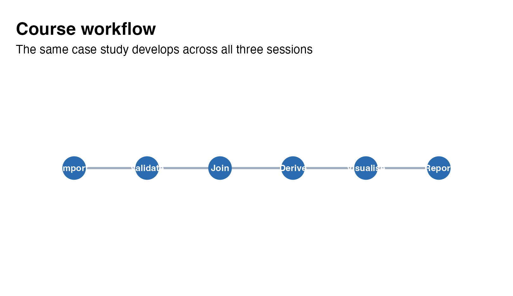
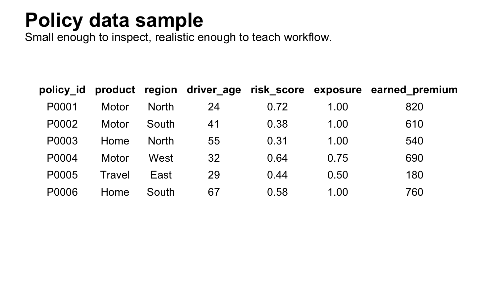
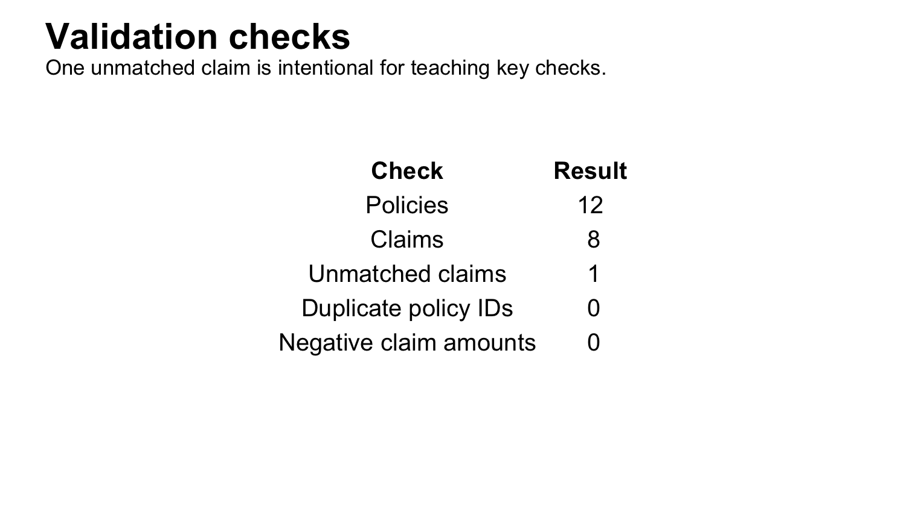
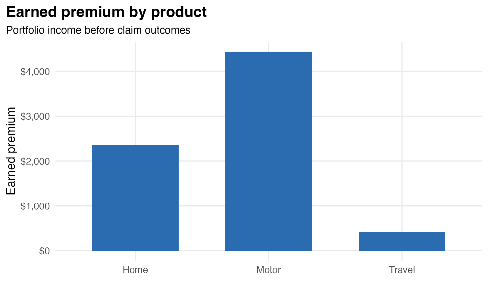
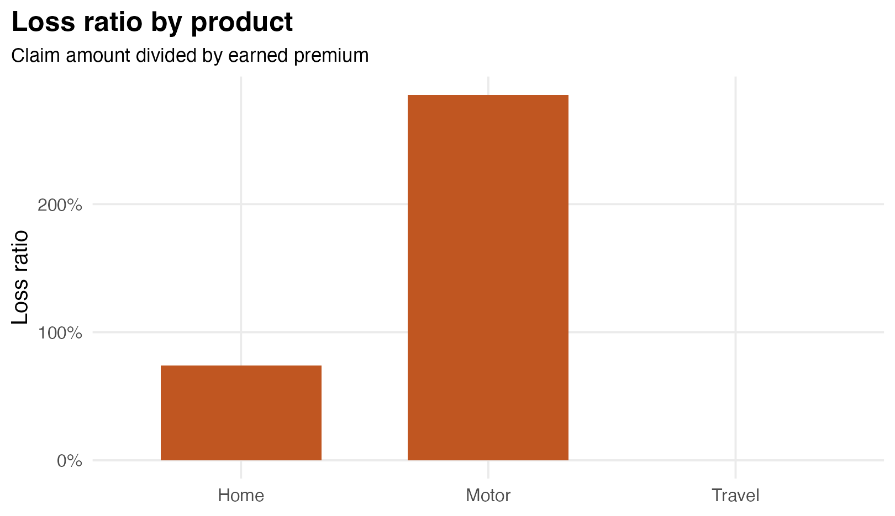
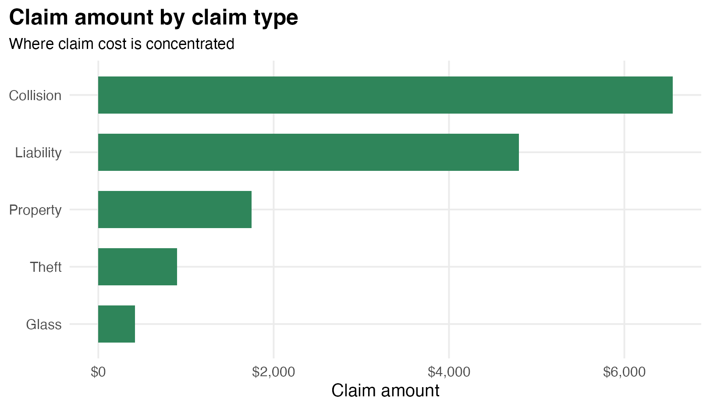
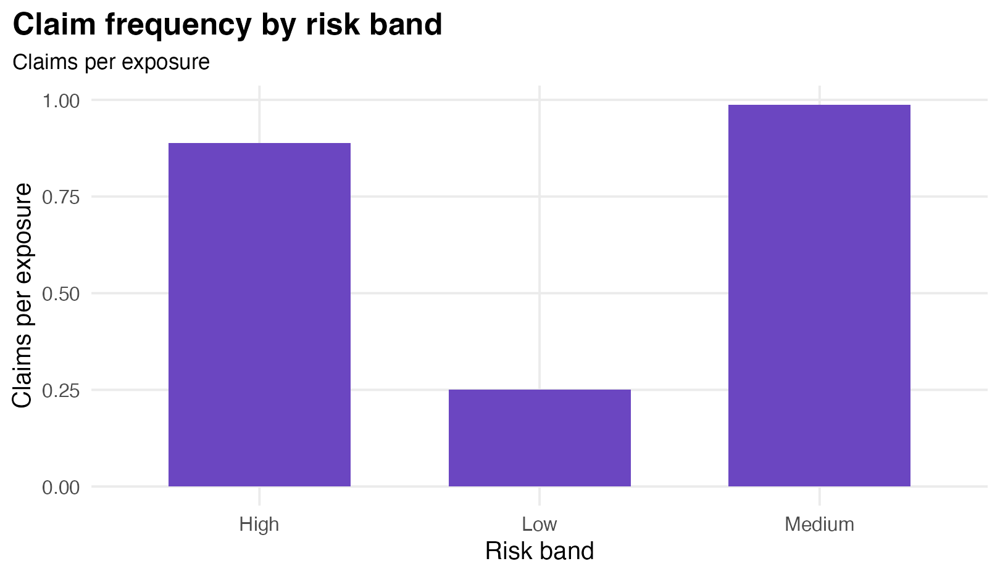

## R for Actuaries 2026

Reproducible analysis, visualization, and AI-assisted learning.

::: {.callout-note}
2026 cohort teaching materials.
:::

::: {.notes}
Open by positioning the course as professional actuarial workflow training, not a generic introduction to R syntax.
:::

## Course Principle

> Write code that another actuary can understand, reproduce, and trust.

## Instructor {.smaller}

Federica Gazzelloni is an actuary, statistician, data scientist, author, and educator specializing in actuarial modelling, health metrics, statistical computing, and reproducible research.

She is the author of *Health Metrics and the Spread of Infectious Diseases* and *CP2 Modelling Practice and Communication*.

[Website](https://federicagazzelloni.com/) · [LinkedIn](https://www.linkedin.com/in/federicagazzelloni/)

## Learning Journey

{fig-alt="Course workflow from import to report" width="92%"}

The same case study develops across all three sessions.

## One Case Study

::: {.columns}
::: {.column width="48%"}
{fig-alt="Sample policy data table" width="100%"}
:::

::: {.column width="52%"}
Raw policy and claims data become:

- validated data
- actuarial measures
- charts
- a Quarto report
:::
:::

## Session 1

### From raw data to clean data

Focus:

- import
- inspect
- validate
- document

## Session 1 Visual Check

{fig-alt="Validation summary table" width="82%"}

One unmatched claim is intentional: students learn to check keys before analysis.

## Session 2

### From clean data to actuarial insight

Focus:

- join policy and claim records
- create derived measures
- summarise by segment

## Core Measures

| Measure | Question |
|---|---|
| Claim frequency | How often? |
| Average severity | How large? |
| Pure premium | How much per exposure? |
| Loss ratio | How much of premium is used by claims? |

## Session 2 Example

{fig-alt="Earned premium by product chart" width="88%"}

Start with portfolio size and premium before interpreting claim outcomes.

## Session 2 Example

{fig-alt="Loss ratio by product chart" width="88%"}

Loss ratio connects claims to premium in one interpretable measure.

## Session 3

### From analysis to communication

Focus:

- choose clear charts
- write short interpretations
- render a Quarto report

## Session 3 Example

{fig-alt="Claim amount by claim type chart" width="88%"}

Use charts to show where claim cost is concentrated.

## Session 3 Example

{fig-alt="Claim frequency by risk band chart" width="88%"}

Risk bands turn row-level data into an actuarial comparison.

## AI Checkpoint

1. Try it yourself.
2. Ask AI to explain or debug.
3. Run the code.
4. Check data, dimensions, and outputs.
5. Rewrite the result in your own words.

## AI Is Not Autopilot

Use AI for:

- explanation
- debugging
- first drafts
- assumption checks

Keep actuarial judgement with the analyst.

## Quarto + GitHub

```text
R Project -> Quarto -> Git commit -> GitHub -> published report
```

Reproducibility is part of the actuarial deliverable.

## Teaching Materials

- [Course overview](../index.html)
- [Session 1](../sessions/01-introduction.html)
- [Session 2](../sessions/02-analysis.html)
- [Session 3](../sessions/03-visualization.html)
- [Mini-project](../case-study/actuarial-mini-project.html)

## Final Outcome

Participants leave with:

- a reproducible analysis
- a clean processed dataset
- clear charts
- a Quarto report
- a reusable workflow

## Close

The goal is not to memorise R functions.

The goal is to solve actuarial problems in a way another actuary can understand, reproduce, and trust.
